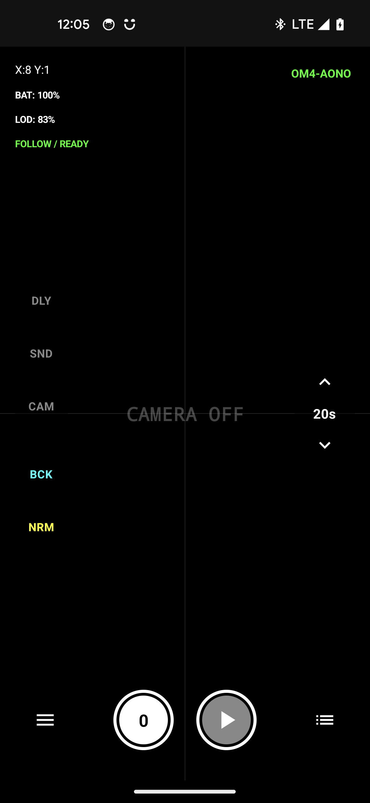

# Gimbal Auto

[](https://www.gnu.org/licenses/gpl-3.0)
[](https://gemini.google.com/)



A modern Android application built with Jetpack Compose and Kotlin, designed for automated trajectory tracking and media capture. This app is designed to work with the **DJI Osmo Mobile 4 (OM4)** gimbal over Bluetooth Low Energy (BLE).

---

## Features

- **Gimbal Integration & Telemetry**: Establish BLE connections to stream real-time pitch, yaw, motor load, battery percentages, and status reports.
- **Interactive Waypoint Pathing**: Set 3D target coordinates dynamically and playback the path over customizable durations.
- **Spline Visualizer**: Visualizes waypoint paths relative to the current camera view on a 3D unit-sphere coordinate system, rendered using an overlay Canvas.
- **Advanced Media Capture**:
  - Automatically records camera feeds upon path execution.
  - Supports **Normal Video**, **Slow-Motion**, and stabilized **Timelapse** capture with adjustable interval timings.
  - Features front/rear camera lens switching.
- **Path & Project Management**:
  - Save, browse, and load preset paths locally.
  - Categorize recordings under distinct projects.
- **Built-in Media Gallery**: Browse, delete, and preview captured `.mp4` video files or skim through timelapse frame folders directly within the app.
- **Foreground Pathing Service**: Ensures continuous and precise command dispatch during trajectory execution.

---

## Getting Started

To prepare, build, and deploy the application to your physical Android device, use the included shell scripts.

### 1. First-Time Setup (`run_once.sh`)

Before building the app, make sure your Android device is connected to your Linux machine via USB with **USB Debugging** enabled in the Developer Options.

Run the preparation script to set up all system prerequisites and compile the app for the first time:

```bash
chmod +x run_once.sh
./run_once.sh
```

**What this script does:**
1. Installs system dependencies (`openjdk-17-jdk`, `unzip`, `wget`).
2. Downloads and configures the Android SDK Command Line Tools under `~/Android/Sdk`.
3. Adds `ANDROID_HOME` and platform-tools paths to your `~/.bashrc`.
4. Interactive setup: Scans your USB ports, prompts you to select your target phone, and configures the required **udev rules** (`/etc/udev/rules.d/51-android.rules`) to grant USB debug access.
5. Reinitializes the ADB server.
6. Uninstalls any conflicting existing builds of the app on the device.
7. Compiles and installs the debug app using `./gradlew installDebug`.

> [!IMPORTANT]
> During execution, look at your phone's screen and accept the **Allow USB debugging** authorization prompt.

---

### 2. Subsequent Runs (`run.sh`)

Once the initial environment and hardware udev rules have been configured, you can rebuild and redeploy the app at any time by running:

```bash
chmod +x run.sh
./run.sh
```

**What this script does:**
1. Cleans the previous Gradle cache.
2. Compiles the modern Kotlin codebase.
3. Installs the new debug APK directly onto your authorized Android device over ADB.
